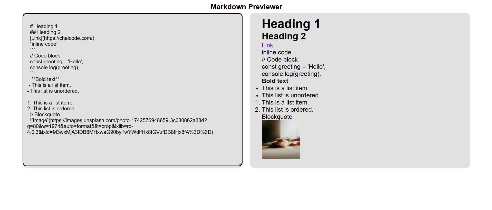

# Markdown-previewer
Welcome to Markdown Previewer, a simple yet powerful Markdown Previewer. This application displays a text area and shows a real-time preview. The app is built using HTML, CSS, JavaScript, and cds.

## 🚀 Features
- 📖 User can type any mark in textarea and show the real time preview of render html

- 📱 Responsive Design – Works seamlessly on all screen sizes, from desktops to mobile devices.

## 🛠️ How to Use
- Clone or download the repository.

- Open the project using your preferred IDE.

- The app contains:

   - HTML file(index.html)

  - CSS file(styles.css)

  - JavaScript file (app.js)

- If you're using VS Code, open index.html with Live Server.

## 🤝 Contribution
If you find areas for improvement, have bug fixes, or want to add more features, feel free to contribute! Pull requests are welcome.

## 🎉 Enjoy the App! 
https://markdown-previewer-cohort.netlify.app/
